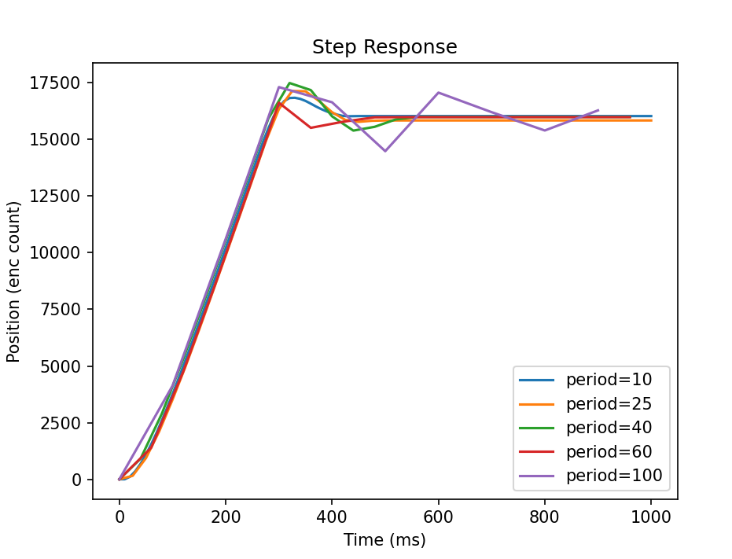
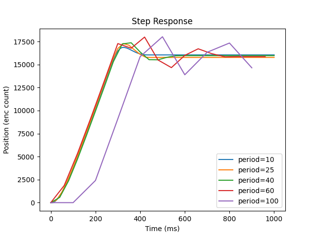

# Lab 3
 For this lab, our team created a cooperatively multitasking program that controls two seperate motors. We send it an automated series of inputs for our Kp and setpoints for each response test. We also gave  it a sufficient delay between response tests so that the motor had time to settle. 

## Responses

Figure 1: Step response of the motors with differing task period

Figure 2: second step response fo the motors with differing task period.

As we can see from the step response the values are pretty decent up to a period of 40ms.
However, after this the step response degenerates. As we can see from the second figure
the motor struggles to build up in a good amount of time.  
